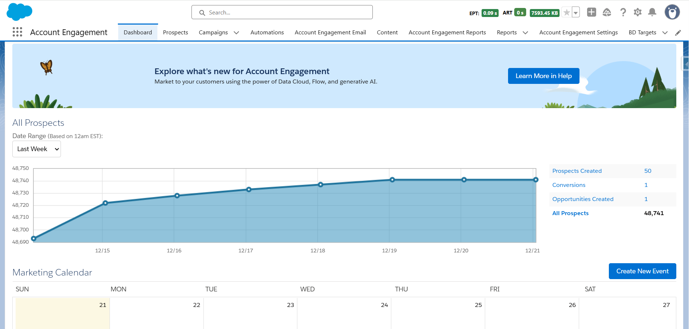

# 📊 Pardot-Salesforce Integration & Marketing Automation


## Overview

A comprehensive Salesforce and Pardot (Account Engagement) integration enabling seamless mass email automation and lead engagement tracking across marketing and sales teams. The solution unified previously siloed email engagement data into Salesforce, providing real-time visibility into prospect interactions and enabling data-driven sales follow-ups with clean, compliant data synchronization.

**Role:** Senior Salesforce Developer & Marketing Cloud Specialist  
**Duration:** 1 month

---

## The Problem

- **Siloed data** - Marketing engagement isolated in Pardot, invisible to sales
- **Manual lead handoff** - No automated prospect-to-lead conversion workflow
- **Lost engagement context** - Sales teams unaware of email opens, clicks, downloads
- **Inconsistent data** - Duplicate records and mismatched ownership across platforms
- **No ROI visibility** - Campaign attribution disconnected from opportunities
- **Compliance gaps** - Uncoordinated GDPR/CAN-SPAM management across systems

---

## The Solution


*Account Engagement dashboard showing prospect analytics and campaign performance*

### Key Features Built

✅ **Bidirectional Connector** - Real-time sync between Pardot and Salesforce  
✅ **Automated Email Campaigns** - Mass email deployment with engagement tracking  
✅ **Activity Sync Workflows** - Email opens, clicks, and form submissions pushed to Salesforce  
✅ **Lead Scoring Integration** - Synchronized scoring and grading models  
✅ **Campaign Performance Dashboards** - Real-time ROI and conversion tracking  
✅ **Data Governance** - GDPR/CAN-SPAM compliance with duplicate prevention

---

## Technical Implementation

### Architecture Overview
```
Salesforce CRM
       │
       ├── Leads, Contacts, Accounts
       ├── Campaign Members
       ├── Tasks & Activities
       └── Opportunity Attribution
       │
       ↕ Bidirectional Sync (Pardot Connector)
       │
Pardot (Account Engagement)
       │
       ├── Prospects Database
       ├── Email Templates & Campaigns
       ├── Engagement Tracking
       │   ├── Email Opens
       │   ├── Link Clicks
       │   ├── Form Submissions
       │   └── Website Visits
       │
       ├── Scoring & Grading
       │   ├── Lead Score (behavior)
       │   └── Lead Grade (fit)
       │
       └── Marketing Calendar & Automation
```

### Data Flow Architecture
```
Marketing Team → Pardot Email Campaign
                      ↓
              Prospect Engagement
                      ↓
         ┌────────────┴────────────┐
         │                         │
    Email Opens              Link Clicks
         │                         │
         └────────────┬────────────┘
                      ↓
         Connector Sync (Real-time)
                      ↓
              Salesforce CRM
                      ↓
         ┌────────────┴────────────┐
         │                         │
    Task Created            Lead Score Updated
         │                         │
    Sales Team Alert        Priority Queue
```

### Tech Stack

| Component | Technology |
|-----------|-----------|
| **CRM** | Salesforce Sales Cloud |
| **Marketing Automation** | Pardot (Account Engagement) |
| **Integration** | Pardot Connector, REST API |
| **Email Engine** | Pardot Email Studio |
| **Analytics** | Salesforce Reports & Dashboards |
| **Compliance** | GDPR tools, CAN-SPAM validation |
| **Scoring** | Lead Scoring & Grading models |

---

### Business Impact
- **48,741 prospects** actively managed with engagement tracking
- **100% marketing-sales visibility** - Eliminated data silos
- **Real-time lead prioritization** - Sales teams focus on hot prospects
- **Automated compliance** - GDPR/CAN-SPAM validation built-in
- **Enhanced attribution** - Accurate campaign-to-opportunity tracking

---

## Key Technical Achievements

### 1. Sophisticated Connector Rules

Built intelligent prospect-to-lead/contact matching:
- Email-based deduplication
- Custom matching logic for edge cases
- Ownership preservation across systems
- Automated lead assignment rules

### 2. Bidirectional Field Mapping

Preserved data lineage across platforms:
```apex
Pardot Prospect ←→ Salesforce Lead/Contact
├── Score → Pardot_Score__c
├── Grade → Pardot_Grade__c
├── Engagement → Last_Engagement_Date__c
└── Activities → Tasks & Activities
```

### 3. Granular Activity Sync

Pushed engagement data to Salesforce:
- Email opens → Logged as completed tasks
- Link clicks → With URL tracking
- Form submissions → With field data
- Website visits → With page views

---

## Related Projects

Check out my other marketing solutions:
- [Email Threading System](../email-threading-system) - Custom email tracking
- [AI-Powered Case Summary](../ai-case-summary) - AI for customer insights
- [Renewal Navigator](../custom-lwc-redesigning) - Automated renewal tracking

---

<div align="center">

**Questions about this project?**

📧 [Email](mailto:murtazamutahar@gmail.com) | 💼 [LinkedIn](https://www.linkedin.com/in/mutahar-murtaza-salesforce/) | 🏔️ [Trailblazer](https://www.salesforce.com/trailblazer/mmurtaza4)

---

Built by Mutahar | Senior Salesforce Developer

</div>
